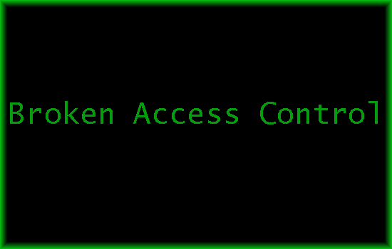

# BAC (Broken Access Control)

---
## Table:

* [WHOIS](#whois)
* [SUB](#sub)
* [REF](#ref)

## WHOIS 

Access control, sometimes called authorization, is how a web application grants access to content and functions to some users and not others. These checks are performed after authentication, and govern what ‘authorized’ users are allowed to do. Access control sounds like a simple problem but is insidiously difficult to implement correctly. A web application’s access control model is closely tied to the content and functions that the site provides. In addition, the users may fall into a number of groups or roles with different abilities or privileges.

Developers frequently underestimate the difficulty of implementing a reliable access control mechanism. Many of these schemes were not deliberately designed, but have simply evolved along with the web site. In these cases, access control rules are inserted in various locations all over the code. As the site nears deployment, the ad-hoc collection of rules becomes so unwieldy that it is almost impossible to understand.

Many of these flawed access control schemes are not difficult to discover and exploit. Frequently, all that is required is to craft a request for functions or content that should not be granted. Once a flaw is discovered, the consequences of a flawed access control scheme can be devastating. In addition to viewing unauthorized content, an attacker might be able to change or delete content, perform unauthorized functions, or even take over site administration.

One specific type of access control problem is administrative interfaces that allow site administrators to manage a site over the Internet. Such features are frequently used to allow site administrators to efficiently manage users, data, and content on their site. In many instances, sites support a variety of administrative roles to allow finer granularity of site administration. Due to their power, these interfaces are frequently prime targets for attack by both outsiders and insiders.

## SUB

1. IDOR : Insure Direct Object Reference
2. CSRF : Cross-Site Request Forgery 
3.  CORS : Cross-Origin Resource Sharing Miscofiguration

## REF

* [OWASP TOP 10](https://owasp.org/Top10/A01_2021-Broken_Access_Control/)

